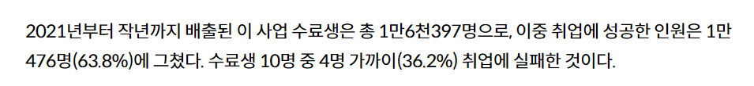

# SWYP7


# 의존성
------
- Spring Boot Starter Web
- MyBatis Spring Boot Starter
- PostgreSQL Driver
- Lombok (Optional)
- Spring Boot DevTools
- Spring Boot Starter Test
- MyBatis Spring Boot Starter Test


# ERD 


# 밀도 커밋 컨벤션
1. 제목과 본문을 한 줄 띄워 분리하기

    ex) 
    ```
    [STYLE] sqlMapConfig.xml 수정 및 db.properties 위치 변경
    
    resource 주소 변경
    classpath(resources 패키지)를 기준으로 하기에 경로에 맞게 수정
    ```
2. 제목은 한글 기준 30자 이내
3. 설명 일관되게 통일
   >ex) ~기능 구현, ~작성, ~출력, ~삭제, ~생성, ~수정 등
4. TYPE은 대문자로 통일    
   >ex) [FEAT], [FIX], [DOCS], [STYLE], ...

### TYPE 종류
> **feat**: 새로운 기능 (기능 구현)
> 
>**fix**: 버그 수정
> 
>**docs**: documentation 변경
> 
>**style**: 코드 의미에 영향을 주지 않는, 코드가 아닌 스타일에 관련된 변경사항(포맷, 공백, 빼먹은 세미콜론, 함수 이름 변경, 줄간격, 파일 이름, 의미없는 주석 삭제)
>
>**refactor**: 리팩토링에 대한 커밋(버그를 수정하지 않고 기능을 추가하지 않는 코드 변경)
>
>**test**: 누락된 테스트 추가 또는 기존 테스트 수정
>
>**chore**: 패키지 매니저 설정할 경우, 코드 수정 없이 설정을 변경 (eslint, prettier... 패키지 설정)


# Test Case 고려사항
1. 2년에 약 1만6천여명, 1년에 8,000명으로 추정함
2. - 추정치의 20%인 1,600명이 이용하는 서비스를 목표
   - 약 100명의 동시접속을 고려
   - 학원이 끝나는 17:00 ~ 18:00 및 저녁시간 대에 피크 이용자가 있을 것으로 고려 (200명)
   -  참고자료
   
3. 현재 백준사이트에서 JAVA를 기준으로 채점되는 양이 10분 기준 약 100개로 추정(모든언어 기준 600개), 동시접속자
   - 가장 큰 사이트에서 한 시간에 600개 정도 커밋이 되므로, 위의 3. 정도의 규모가 후에 확장성을 고려해도 괜찮을 것으로 판단.
